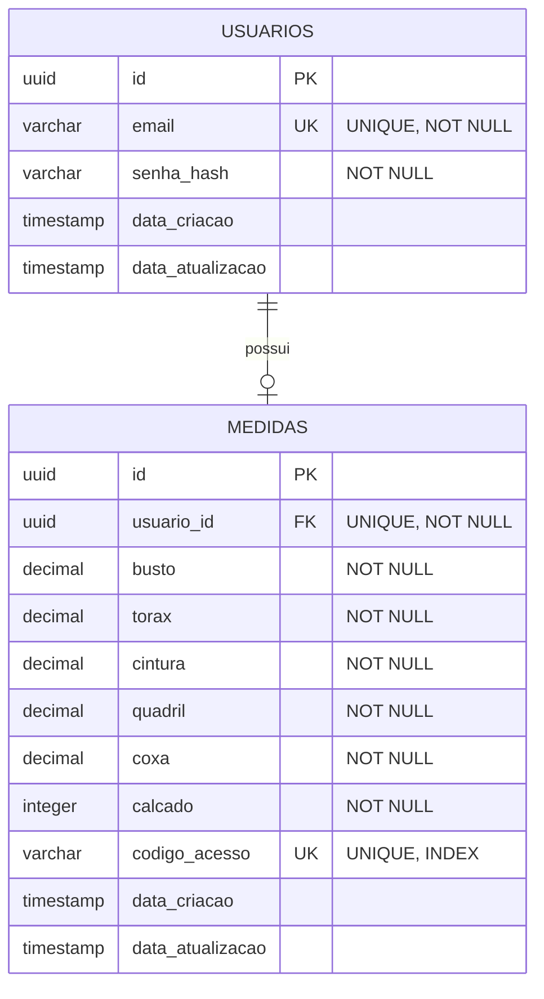

# SLIDE 17 - Modelagem do Banco de Dados

---

## 📊 Diagrama ER - Renderiza Automaticamente

**O diagrama abaixo renderiza automaticamente no MkDocs!**



---

## 📋 Estrutura Detalhada

### 🔹 Tabela: usuarios

```sql
id              UUID PRIMARY KEY
email           VARCHAR(255) UNIQUE NOT NULL
senha_hash      VARCHAR(255) NOT NULL
data_criacao    TIMESTAMP DEFAULT CURRENT_TIMESTAMP
data_atualizacao TIMESTAMP DEFAULT CURRENT_TIMESTAMP
```

**Descrição:**
- `id`: Identificador único do usuário
- `email`: Email único para login
- `senha_hash`: Senha criptografada (bcrypt/passlib)
- `data_criacao`: Data de cadastro
- `data_atualizacao`: Data da última modificação

---

### 🔹 Tabela: medidas

```sql
id              UUID PRIMARY KEY
usuario_id      UUID UNIQUE NOT NULL REFERENCES usuarios(id)
busto           DECIMAL(5,2) NOT NULL
torax           DECIMAL(5,2) NOT NULL
cintura         DECIMAL(5,2) NOT NULL
quadril         DECIMAL(5,2) NOT NULL
coxa            DECIMAL(5,2) NOT NULL
calcado         INTEGER NOT NULL
codigo_acesso   VARCHAR(50) UNIQUE NOT NULL
data_criacao    TIMESTAMP DEFAULT CURRENT_TIMESTAMP
data_atualizacao TIMESTAMP DEFAULT CURRENT_TIMESTAMP
```

**Descrição:**
- `id`: Identificador único das medidas
- `usuario_id`: Referência ao usuário (FK UNIQUE)
- `busto, torax, cintura, quadril, coxa`: Medidas em cm (DECIMAL)
- `calcado`: Número do calçado (INTEGER)
- `codigo_acesso`: Código único para consulta pública
- Datas de auditoria

---

## 🔗 Relacionamentos

**USUARIOS (1) ─── (0..1) MEDIDAS**

- Um usuário pode ter **zero ou uma** cadastro de medidas
- Um cadastro de medidas pertence a **exatamente um** usuário
- `ON DELETE CASCADE`: Se usuário é deletado, suas medidas também são

---

## 📐 Regras de Negócio

✅ **Email único** - Cada usuário tem um email único  
✅ **Senha segura** - Armazenada como hash (Passlib com bcrypt)  
✅ **Uma medida por usuário** - usuario_id é UNIQUE na tabela medidas  
✅ **Código único** - Cada código de acesso é único no sistema  
✅ **Validação de valores** - Medidas devem ser positivas (CHECK)  
✅ **Deleção em cascata** - Deletar usuário remove suas medidas  
✅ **Índice no código** - Busca rápida por código de acesso  

---

## 🗂️ Normalização

O modelo está em **3ª Forma Normal (3FN)**:

- ✅ **1FN:** Todos os atributos são atômicos
- ✅ **2FN:** Não há dependências parciais da chave
- ✅ **3FN:** Não há dependências transitivas

---

## 📸 Como Exportar para o PowerPoint

### Opção 1: Screenshot Direto (Recomendado)
1. Visualize este slide no MkDocs
2. Zoom no diagrama ER
3. Use Print Screen ou ferramenta de screenshot
4. Cole no PowerPoint Slide 17

### Opção 2: Mermaid Live (Alta Resolução)
1. Copie o código Mermaid acima
2. Acesse: https://mermaid.live/
3. Cole e renderize
4. Download PNG/SVG
5. Insira no PowerPoint

---

## 💡 Por que Este Modelo?

✅ **Simples e eficiente** - Apenas 2 tabelas  
✅ **Normalizado** - Sem redundância de dados  
✅ **Escalável** - Fácil adicionar campos se necessário  
✅ **Performático** - Índices nas chaves estrangeiras e código  
✅ **Seguro** - Senhas com hash, validações implementadas  

---

*O diagrama renderiza automaticamente no MkDocs. Faça screenshot ou exporte para inserir no PowerPoint!*
