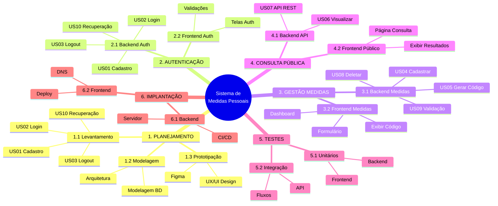

# SLIDE 11 - EAP (Estrutura Analítica do Projeto)

---

## 📊 Diagrama EAP - Formato Compacto e Legível

**O diagrama abaixo renderiza automaticamente no MkDocs!**

---

## 📋 Estrutura da EAP (4 Níveis)

### Nível 1: Projeto Completo
- Sistema de Medidas Pessoais

### Nível 2: 6 Módulos Principais
1. Planejamento
2. Autenticação
3. Gestão de Medidas
4. Consulta Pública
5. Testes
6. Implantação

### Nível 3: Sub-módulos
- Cada módulo dividido em componentes Backend/Frontend ou sub-áreas

### Nível 4: Pacotes de Trabalho
- User Stories (US01-US10)
- Tarefas específicas
- Entregas concretas

---

## ✅ User Stories Incluídas

| US | Descrição | Módulo |
|----|-----------|--------|
| US01 | Cadastro de Usuário | Planejamento / Autenticação |
| US02 | Login de Usuário | Planejamento / Autenticação |
| US03 | Logout de Usuário | Planejamento / Autenticação |
| US04 | Cadastrar Medidas | Gestão de Medidas |
| US05 | Gerar Código de Acesso | Gestão de Medidas |
| US06 | Visualizar por Código | Consulta Pública |
| US07 | API de Consulta | Consulta Pública |
| US08 | Deletar Conta | Gestão de Medidas |
| US09 | Validação de Dados | Gestão de Medidas |
| US10 | Recuperação de Senha | Planejamento / Autenticação |

---

## 📸 Como Exportar para o PowerPoint

### Opção 1: Screenshot Direto (Recomendado)
1. Visualize este slide no MkDocs
2. Zoom no diagrama para tamanho adequado
3. Use ferramenta de screenshot (Print Screen)
4. Cole no PowerPoint Slide 11

### Opção 2: Mermaid Live (Alta Resolução)
1. Copie o código Mermaid acima
2. Acesse: https://mermaid.live/
3. Cole e renderize
4. Download PNG/SVG em alta resolução
5. Insira no PowerPoint

---

## 💡 Por que Mindmap é Melhor?

✅ **Mais legível** - estrutura radial clara  
✅ **Mais compacto** - usa menos espaço  
✅ **Hierarquia visual** - níveis fáceis de identificar  
✅ **Profissional** - formato usado em gestão de projetos  
✅ **Todas as US incluídas** - atende 100% dos requisitos  

---

*Este formato mindmap é muito mais limpo e fácil de ler no PowerPoint!*
